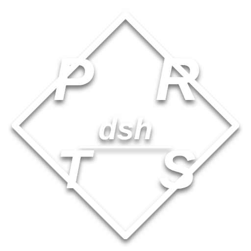

# dsh-prts-ui

<p align="center">
  
</p>

<p align="center">
  <a href="https://github.com/missercatos/dsh-prts-ui/releases"></a>
  <a href="./LICENSE"></a>
  <a href="https://github.com/missercatos/dsh-prts-ui/releases"></a>
</p>

**v0.9.2** · PRTS 是 **dsh（DeepSeek Harness）的 GUI 外壳**，不是独立软件。它复用 dsh 的 `/api` RPC + WebSocket 协议镜像 dsh 的真实状态：工作区、会话、模型、凭证、工具、插件都来自 dsh；PRTS 只提供外观与操作面板。因为只依赖 dsh 稳定的 `/api` 协议，dsh 升级不会让它失效。

本版（0.6.x）已针对**当前 dsh 内核（v4 代 / `session.list`→`items`、`/api/events.mux` 为 WebSocket）**逐项修正并实测。

## 功能（全部照搬 dsh 的能力）

- **工作区**：侧栏列表、新建/删除、头部面包屑随时切换；侧栏顶部与初始页输入框上方都有工作区选择芯片（切换/添加），新建工作区优先打开系统默认文件管理器选目录（Electron 原生对话框，Windows/Linux/macOS 通用），也保留手写路径兜底
- **会话**：新建会话、归档、**搜索会话**（本地过滤 + dsh 的 session.search）、**多选批量归档**（选择模式 + 全选，配合搜索可一键清掉一批）
- **轨迹与日志拆分**：“轨迹”页签是**分步时间线**（按轮/步分组：每一步的模型/工具事件与耗时）；“会话日志”按钮是独立的**原始事件日志**浮层（可导出 JSON）
- **模式选择**：dsh 自己的 agent preset（标准 / PTC / 极简 / 创造…）。空白会话直接切换；**已开始的会话模式锁定**（dsh 约束），改模式会提示并以所选模式新建会话
- **模型选择**：先选厂商再选模型（`session.models` 实时显示当前模型）
- **推理等级**：模型自带的 reasoning efforts（Off / High / Max，经 `session.selectModel` 的 `reasoningEffort`）
- **权限等级**：会话 projection 里的 permission presets（read-only / workspace-write / danger-full-access…，经 `/permission` 命令）
- **传递文件**：附加图片（PNG/JPEG/WebP/GIF）随消息发送，历史里的图片自动回读
- **审批 / 提问**：`approval/requested`、`question/requested` 弹卡，可批准/拒绝/回答
- **上下文仪表**：输入框旁的百分比环显示上下文窗口占用（projection `contextPressure`）
- **底部统计条**：与会话页同款实时统计 —— `6 轮 · 311 步 · LLM 51m15s · 工具调用 7m00s · 首 token 平均 2.6s · 113 tok/s · 缓存命中 99% · 输入 86M tok · 输出 255K`（projection `sessionStats`/`tokenUsage`，mux `session/projection` 帧实时刷新 + 8s 轮询兜底）
- **语音输入**：完整可用的麦克风语音转文字 —— 首次开启弹窗询问麦克风权限；VAD 检测说话/静音自动开始与结束；识别引擎为本地 whisper-tiny ONNX（首次使用从 npmmirror / hf-mirror 下载引擎与模型到 `~/.cache/prts/stt/`，之后完全离线），浏览器里有 `webkitSpeechRecognition` 时自动优先
- **初始页选择器**：初始输入区上方参照 dsh web 的设计有一排选择芯片 —— 文件夹（工作区切换/添加）、模式（标准 / PTC / 极简 / 创造…）、模型与推理等级，未选会话也能直接切换
- 其余：三幕粒子开场（welcome → PRTS·DEEPSEEK 横幅 → 菱形标志，每幕 3.2s）兼作加载动画 —— dsh 未就绪时循环播放、点击弹出“未就绪”提示，就绪后三幕播完自动进入或点击直接进入；系统面板（硬件遥测）、设置、插件市场、Git 面板、Skill 坞、中英文界面、明暗主题

## 设置（0.3.0 重做）

设置面板与 dsh web 官方设置同构：**通用设置 / 模型 / 插件 / Agent预设** 四个官方分区（数据源为 settings.describe、llm.providers、agentPreset.list 等官方 RPC），外加 PRTS 扩展分区：

- **余额**：登录跳转 DeepSeek 创作者 API 官网（platform.deepseek.com）；官网已登录则直接返回并显示已登录。API Key 自动写入 dsh 凭证（DEEPSEEK_OFFICIAL_API_KEY）供会话使用；余额走官方接口以人民币显示；充值按钮直达官方充值页。首次登录后无需再登录。
- **Git**：连接 GitHub（跳转官网登录、会话复用、令牌自动捕获/手动粘贴兜底）；支持创建仓库、选择目录直接上传项目（git init/commit/push）；面板内渲染 GitHub 贡献热力图（PRTS 单色菱形配色）。
- **Skill**：侧栏 Skill 坞——skill 多选组成 skill 组；人格类 skill（AI 人格记忆）单选；设置内可编辑 SKILL.md 源文件；支持从 GitHub 仓库安装 skill 到 ~/.dsh/skills。

## 侧栏与市场

- 左侧扩展栏：Git / Skill / 市场 / 详情 / 设置（原费用按钮已移除，费用信息并入设置·余额）。
- 插件市场重做：**DSH 插件**与 **SKILL** 两个分区、分类筛选（视觉 / 工具 / 其他 / 人格）、搜索、GitHub skill 直达安装；界面沿用 dsh web 设置面板风格做 PRTS 化。
- 指令目录会列出其他 profile 安装的 CLI 插件（如 `givemyflag`）并可一键在终端中运行——已安装插件不再“不可见”。

## PRTS 人格

- 随包内置 `prts-persona` 人格 skill（~/.dsh/skills/prts-persona/SKILL.md，可在线编辑）：自称 PRTS，称呼用户「博士」（可在设置中自定义为 博士.xxx / Dr.xxx）。
- 提供 **PRTS 模式** agent 预设（~/.dsh/.agent-presets/prts）：标准模式全能力 + PRTS 人格，模式选择器里直接可选。

## 与当前 dsh 内核的兼容性修正（0.2.0）

| 问题 | 修正 |
| --- | --- |
| `/api/events.mux` 现在只接受 WebSocket（普通 GET 返回 `upgrade required`） | 客户端与 Electron 主进程改为 WebSocket 优先、SSE 兜底 |
| `session.list` 返回 `{items}`（旧代码读 `sessions`） | 已对齐；会话标题读 projection `values.title` |
| `session.history` 返回 `{events:[{event,view}]}` | 已对齐，并支持 `beforeSeq/maxMessages` 分页回读（大会话秒开） |
| 流式事件只有 `assistant/chunk`（reasoning-delta/text-delta/tool-call-delta/usage/finish） | 折叠逻辑全部重写，边流边渲染 |
| 命令目录 | 走 `commands/list` RPC（与 dsh web 同源，含插件扩展指令）；旧版无 RPC 时回退为会话 `command/run` 历史 + 内置命令 |
| `session.search` 在部分部署被禁用 | 自动降级为本地标题过滤 |
| Electron 禁用 `window.prompt()`（“新建工作区”等按钮点击即崩） | 换成 PRTS 风格模态框 |
| 审批/提问应答格式 | `respond` 现在正确打包 `{ok:true,value:{...}}` |
| 头部弹层在窗口顶端打开时跑出屏幕 | 弹层按触发器位置自动改为向下展开 |
| 死按钮 | 侧栏折叠/展开统一为左上角固定按钮（折叠后按钮不隐藏，再次点击恢复原宽度）、对话/轨迹页签、会话日志（dsh-web 同款 ZIP 下载 + 原始事件兜底）、上下文仪表均已接线 |
| 设置里“模型配置”折叠钮无效（CSS `display` 压过 `hidden` 属性） | 全局 `[hidden]{display:none!important}`，同时修好附件条/状态行等同类隐患 |
| 发送后卡在“停止”状态（mux 断流导致 streaming 永久为 true） | 流结束/断线都会复位 |
| 流式期间每条 chunk 全量重渲染（大 session 卡顿） | 渲染按帧批处理 + 90ms 节流（实测一轮 9 秒只重写 DOM 16 次）；粒子 willReadFrequently；历史重载 30 秒冷却 |
| 不先开 dsh web 直接启动 PRTS 会报错/卡死 | 启动顺序改为**窗口优先**：PRTS 窗口立即出现，粒子开场作为加载动画，后台静默探测并拉起 `dsh web`（Windows .cmd 垫片可用），就绪后三幕播完自动进入；关闭 PRTS 自动关掉它拉起的 dsh web（pidfile + 兜底 PID，跨平台强杀） |
| 设置“模型配置”折叠瞬间跳变 | 改为网格行高动画（0fr→1fr），文字平滑收起、下方内容平滑上移 |
| Electron 内 GUI 从 file:// 改为仅回环 HTTP 服务（127.0.0.1 随机端口） | 语音引擎的 wasm 模块导入/Worker 需要真实 http 源；API 仍走 preload 桥，无窗口、不外露 |

## 安装（一键，国内网络可用）

所有网络步骤失败时自动回退 npmmirror（npm 镜像、Electron 镜像），无需访问 GitHub。

| 平台 | 安装包 / 方式 |
| --- | --- |
| Windows | `PRTS-Setup-<ver>-windows-x64.exe`（自解压 exe，双击即装）或 `install.bat` |
| Linux | `PRTS-<ver>-linux-x64.run`（自解压）或 `sh install.sh` |
| macOS | `PRTS-<ver>-macos.sh` 或 `sh install.sh` |
| Android | Termux：`sh install-android.sh`（浏览器里跑 dsh web + PRTS）；或把官网作为 PWA“添加到主屏幕” |

安装器做的事：装 Node 环境依赖检查 → 装 dsh（缺省时）→ 装 `prts.config.json` 里列出的插件 → 打包/复用 `dsh-prts-ui-<ver>.tgz` → 装进 `prts` profile → 固定 bundle → 桌面/开始菜单快捷方式 → `prts` 命令入 PATH。

```sh
# 通用：启动
prts                       # 打开 PRTS 窗口（窗口立即出现，粒子开场兼作加载动画；
                           # 底层静默启动/复用 dsh web:3080，不会唤出网页；
                           # 关闭 PRTS 窗口时自动关闭它自己拉起的 dsh web）
dsh --profile prts         # 等价写法
dsh --profile prts --lang zh
dsh --profile web --shortcut   # 刷新桌面快捷方式
```

**配置**：首次安装会生成 `~/.dsh/profiles/prts/prts.config.json`（模板 `prts.config.example.json`），里面可改 npm 镜像、Electron 镜像、插件列表、发布地址。更新时保留你的配置。

**更新**：`sh update.sh`（Windows `update.bat`）会先尝试从 `releaseBase`（官网 releases 目录，读 `releases.json`）下载最新包，失败则本地重建；同时更新 dsh 与插件。

**卸载**：

```sh
dsh plugin --profile prts remove dsh-prts-ui
rm -f ~/Desktop/dsh-prts.desktop ~/.local/share/applications/dsh-prts.desktop
rm -rf ~/.config/prts ~/.dsh/profiles/prts
```

## 运行在本机 dsh 上的插件形态（`/prts`）

GUI 本身就是插件。除了上面的 profile 安装方式，还可以作为**动态 Cordis 插件**挂到正在运行的 dsh 上：Host 半注册 `/prts` 路由（本仓库 `plugin/host.js` + `plugin/client.js`，由本会话的 `prts-1` 插件运行），浏览器打开 `http://127.0.0.1:3080/prts/` 即是完整 PRTS 界面，与当前 dsh 实例同一 origin、同一会话 —— 你在里面聊的就是这个 agent。

## 打包与官网

```sh
sh scripts/make-dist.sh     # 生成 dist/：tgz + .run + .sh + .exe + .zip + SHA256SUMS + releases.json
```

- Windows exe 用 mingw-w64 编译的自解压 stub（`dist-tools/sfx.c`）+ 追加 payload zip，Linux 上也能直接产出；没有 mingw 时退化为 zip + `build-exe.bat`（Windows 自带 IExpress）。
- 官网文件在 `docs/`：粒子特效中英文文字（“欢迎使用PRTS / 这里是dsh-prts官网”…）+ 四个平台下载按钮 + PWA（Android 可安装为应用）。部署说明见 `docs/README.txt`。

## 开发与自测

```sh
pnpm install && pnpm bundle      # 由 src/ + web/src 重新生成 web/index.html
node test/live-transport.mjs     # 对着运行中的 dsh 验证 /api + mux 全链路
node test/cdp-drive.mjs          # 通过 CDP 采集 Electron 窗口状态/截图
node test/cdp-audit.mjs          # 逐个控件命中测试（按钮可点击性）
node test/cdp-interact.mjs       # 功能交互测试（新会话/搜索/弹层/发送/停止）
```

不依赖真实 dsh 的旧 mock 方式见 README 历史版本；现在推荐直接对 3080 跑 live-transport。

## 环境变量

| 变量 | 含义 |
| --- | --- |
| `PRTS_DSH_URL` | 后端 dsh web 地址（默认 `http://127.0.0.1:3080`） |
| `PRTS_ELECTRON` | 预装 Electron 二进制路径（跳过下载） |
| `PRTS_ELECTRON_CACHE` | Electron 缓存目录（默认 `~/.cache/prts/electron`） |
| `ELECTRON_MIRROR` | Electron 下载镜像（安装器默认 npmmirror） |
| `DSH_PRTS_NO_SHORTCUT` | `1` 禁用快捷方式安装 |
| `DSH_PRTS_DESKTOP` | 快捷方式桌面目录（测试用） |
| `DSH_HOME` | dsh 主目录（默认 `~/.dsh`） |

## 许可证

MIT —— 见 [LICENSE](./LICENSE)。7-Zip SFX 与 IExpress 仅为构建工具链，不随包分发额外二进制。
